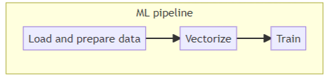

# Course Overview

[Video source](https://www.youtube.com/watch?v=teP9KWkP6SM&list=PL3MmuxUbc_hIUISrluw_A7wDSmfOhErJK&index=6)

When data scientists experiment with Jupyter Notebooks for creating models, they often don't follow best practices and are often unstructured due to the nature of experimentation: cells are re-run with slightly different values and previous results may be lost, or the cell execution order may be inconsistent, for example.

***Module 2*** covers ***experiment tracking***: by using tools such as [MLflow](https://mlflow.org/) we will create ***experiment trackers*** (such as the history of cells that we've rerun multiple times) and ***model registries*** (for storing the models we've created during the experiments), instead of relying on our memory or janky setups such as external spreadsheets or convoluted naming schemes for our files.

***Module 3*** covers ***orchestration and ML pipelines***: by using tools such as [Prefect](https://www.prefect.io/) and [Kubeflow](https://www.kubeflow.org/) we can break down our notebooks into separate identifyable steps and connect them in order to create a ***ML pipeline*** which we can parametrize with the data and models we want and easily execute.

***Module 4*** covers ***serving the models***: we will learn how to deploy models in different ways.

***Module 5*** covers ***model monitoring***: we will see how to check whether our model is performing fine or not and how to generate alers to warn us of performance drops and failures, and even automate retraining and redeploying models without human input.

***Module 6*** covers ***best practices***, such as how to properly maintain and package code, how to deploy successfully, etc.

***Module 7*** covers ***processes***: we will see how to properly communicate between all the stakeholders of a ML project (scientists, engineers, etc) and how to work together.
