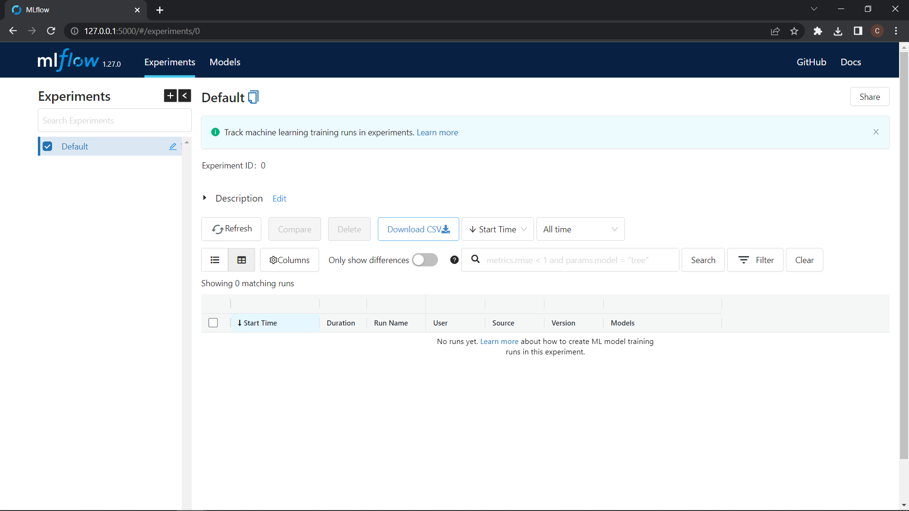

# Getting Started with MLflow

You can create a [conda environment](../Appendixes/B_conda.md) and install MLlow into it, install with:

```bash
pip install mlflow=1.27
```

MLflow has different interfaces, each with their pros and cons. We introduce the core functionalities of MLflow through the UI.


## MLflow UI:

To run the MLflow UI locally we use the command:

```
mlflow ui --backend-store-uri sqlite:///mlflow.db
```
**Note0:** If you don't specified a backend store you can't use the Model Registry.

**Note1:** In the directory you ran the command will be created a `mlruns` directory and `mlflow.db` file.

**Note2:** The backend storage is essential to access the features of MLflow, in this command we use a SQLite backend with the file `mlflow.db` in the current running repository. This URI is also given later to the MLflow Python API `mlflow.set_tracking_uri`.

**Note3:** While the **backend store** persists MLflow entities (runs, parameters, metrics, tags, notes, metadata, etc), the **artifact store** persists artifacts (files, models, images, in-memory objects, or model summary, etc).

By accessing the provided local url in the terminal you can access to the UI and you'll see something like this:



In addition to the backend URI, we can also add an artifact root directory where we store the artifacts for runs, this is done by adding a `--default-artifact-root` paramater:

```
mlflow ui --backend-store-uri sqlite:///mlflow.db --default-artifact-root ./mlruns

```