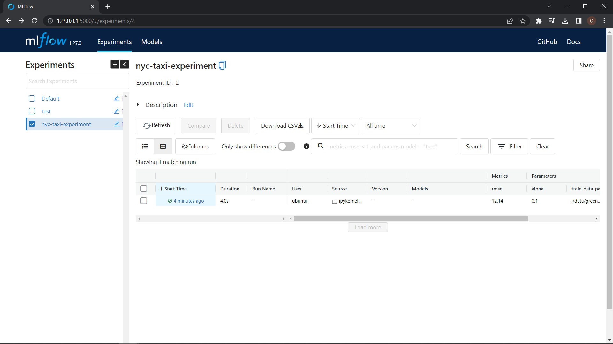
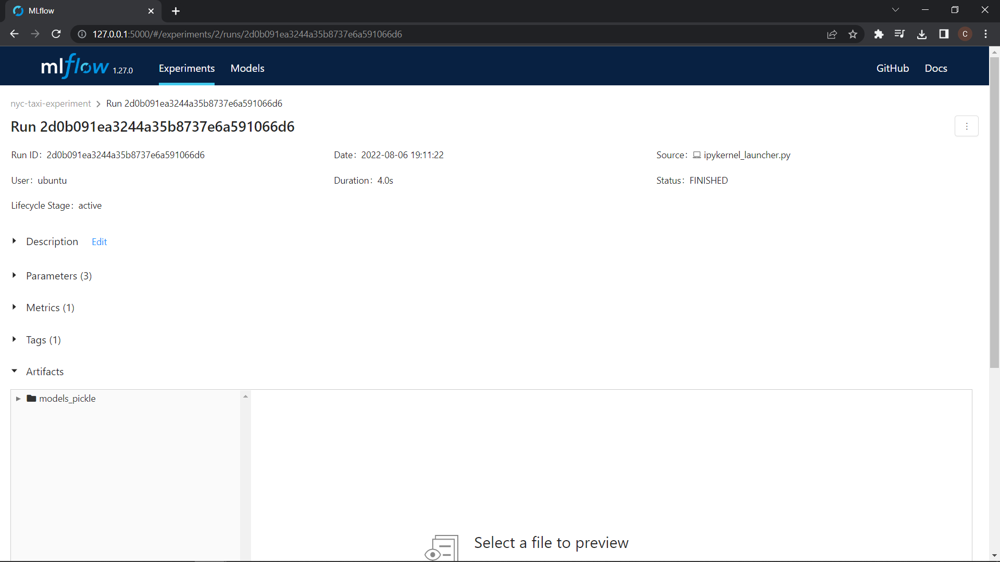

# Tracking a Single Experiment run

In order to track experiment runs, we first initialize the mlflow experiment setting the *tracking uri* and the *experiment* using the code:

```python
import mlflow
mlflow.set_tracking_uri("sqlite:///mlflow.db")
mlflow.set_experiment(EXPERIMENT_NAME)
```

Example:

```python
import mlflow
mlflow.set_tracking_uri("sqlite:///mlflow.db")
mlflow.set_experiment("nyc-taxi-experiment")
```

Where `EXPERIMENT_NAME` is the name of the experiment you want to use(it will be created if doesn't exist')


We can then track a run, we'll use this simple code snippet as a starting point:

```python
alpha = 0.01

lr = Lasso(alpha)
lr.fit(X_train, y_train)

y_pred = lr.predict(X_val)

mean_squared_error(y_val, y_pred, squared = False)
```

We initialize the run using ```with mlflow.start_run():``` and wrapping the whole run inside it. We track the relevant information using  three mlflow commands:

- `set_tag` for Metadata tags
- `log_param` for logging model parameters
- `log_metric` for logging model metrics

In the next example we set:
1. **Metadata tags:** the author name
2. **Log parameters:** training and validation data paths and alpha value
3. **Log metrics:** RMSE

**Note:** The python script or notebooks have to be runned in the same directory as you will run the MLflow UI.

```python
with mlflow.start_run():
    mlflow.set_tag("developer", "Chris")
    
    mlflow.log_param("train-data-path", "data/green_tripdata_2021-01.parquet")
    mlflow.log_param("val-data-path", "data/green_tripdata_2021-02.parquet")
    
    alpha = 0.01
    mlflow.log_param("alpha", alpha)
    lr = Lasso(alpha)
    lr.fit(X_train, y_train)
    
    y_pred = lr.predict(X_val)
    rmse = mean_squared_error(y_val, y_pred, squared = False)
    mlflow.log_metric("rmse", rmse)
```

Now if we run this then in the MLflow UI you'll see a new experiment `nyc-taxi-experiment`and inside it will be a new run with our logged parameters, tag, and metric.



If you click in the time ago fo the run you'll se all the logs.


