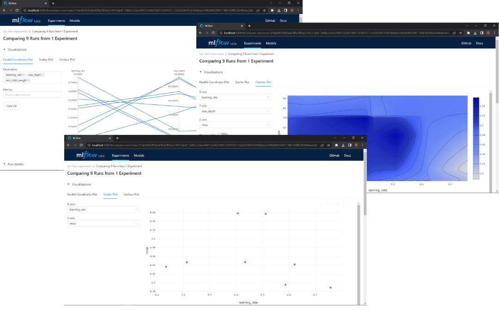

# Tracking a Multiple Experiment runs(Hyperparameter Optimization)


If you want to track Hyperparameter Optimization you can do a for loop with ```with mlflow.start_run():``` inside and try a different hyperparameters in each iteration, but this is not a efficient way, then we are going to use `hyperopt` this python library use bayesian methods to find the best hyperparameters in a efficient way. If you want to know more about hyperopt you can chek de [Hyperopt Documentation](http://hyperopt.github.io/hyperopt/). We import some classes from `hyperopt`:
- `fmin`: Try to minimize and output(a metric)
- `tpe`: Algorithm to control the logic of the optimization
- `hp`: Include different methods to define the search space
- `STATUS_OK`: Signal to tell hyperopt the objetive function has run successfully
- `Trials`: Keep track information of each run
- `scope`: Define a range of type integer

And now by wrapping the hyperopt Optimization objective inside a with `with mlflow.start_run()` block, we can track every optimization run that was ran by hyperopt. We then log the parameters passed by hyperopt as well as the metric as follows:


```python

import xgboost as xgb

from hyperopt import fmin, tpe, hp, STATUS_OK, Trials
from hyperopt.pyll import scope

train = xgb.DMatrix(X_train, label=y_train)
valid = xgb.DMatrix(X_val, label=y_val)

def objective(params):
    with mlflow.start_run():
        mlflow.set_tag("model", "xgboost")
        mlflow.log_params(params)
        booster = xgb.train(
            params=params,
            dtrain=train,
            num_boost_round=1000,
            evals=[(valid, 'validation')],
            early_stopping_rounds=50
        )
        y_pred = booster.predict(valid)
        rmse = mean_squared_error(y_val, y_pred, squared=False)
        mlflow.log_metric("rmse", rmse)

    return {'loss': rmse, 'status': STATUS_OK}

search_space = {
    'max_depth': scope.int(hp.quniform('max_depth', 4, 100, 1)),
    'learning_rate': hp.loguniform('learning_rate', -3, 0),
    'reg_alpha': hp.loguniform('reg_alpha', -5, -1),
    'reg_lambda': hp.loguniform('reg_lambda', -6, -1),
    'min_child_weight': hp.loguniform('min_child_weight', -1, 3),
    'objective': 'reg:linear',
    'seed': 42
}

best_result = fmin(
    fn=objective,
    space=search_space,
    algo=tpe.suggest,
    max_evals=50,
    trials=Trials()
)

```

In this block, we defined the search space and the objective than ran the optimizer. We wrap the training and validation block inside `with mlflow.start_run()` and log the used parameters using `log_params` and validation RMSE using `log_metric`.

In the UI will be the runs generated by hyperopt, since we use the tag `mlflow.set_tag("model", "xgboost")` you can filter the runs typingin the search section(in the UI):
```bash
tags.model = "xgboost"
```

In the UI you can compare all this runs following **Filter xboost models -> Select all of them -> CLick in Compare** and you will can visualize a Parallel Coordinates Plot, Scatter Plot and Contour Plot.



If you want to know how to read this kind of visualizations you can check this [video](https://youtu.be/iaJz-T7VWec?list=PL3MmuxUbc_hIUISrluw_A7wDSmfOhErJK&t=684)


## Selecting the Best Model

When you select the best model is importan to check not just the performance, is important to check:

- **Performance**
- **Training time**
- **Model Size(Complexity)**

Could be that a model has the best performance but the training time and the model size are very bigger than the other model, in that case could be better to choose a model with lower performance but a lower training time and model size.

Onece you have select the best model you have to run again the model with the best parameters, you can use autologging to avoid write the mlflow logs.