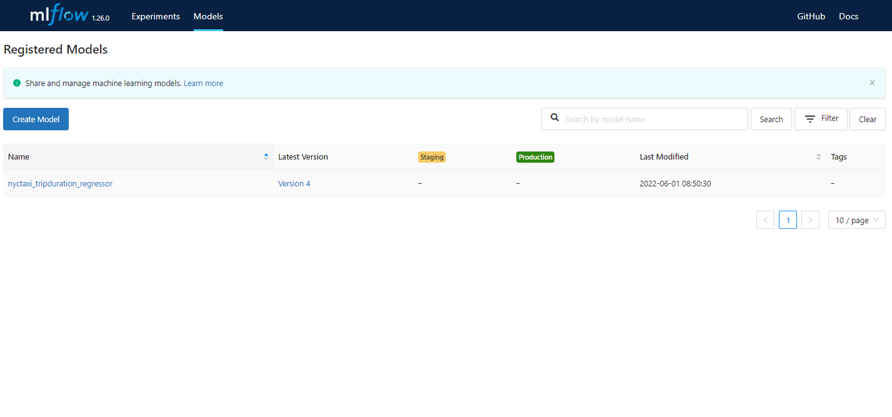

# Model Registry

The Data Scientist decides what models in the tracking server are ready to production and then can register those models into the mlflow registry in that way the Deployment Engineer can take a look in the model registry and see whats models are ready for production. In that way the communication between the person that is in charge of building the model and the person is in charge of deploying the model is improved.


Model Registry only lists models that are production-ready(don't perform the deployment *perse*) and the stages are just labels assigned to the model. To deploy the model, we will require to implement CI/CD code to communicate with Model Registry.

**Note:** To use the Model Registry you need to specify a backend store.
## Model Registry using UI

**Storing Models in the Registry**

In order to register models using the UI, we select the run whose model we want to register and then select "Register Model". There we may either create a new model registry or register the model into an existing registry. We can view the registry and the models there in by selecting the "Models" tab in the top and selecting the registry we want.



**Promoting and Demoting Models in the registry**

Models in the registry are labeled either as Staging, Production or Archive. Promoting and demoting a model can be done by selecting the model in the registry and selecting the stage of the model in the drop down "Stage" Menu at the top.


## Model Registry using Tracking Client

**Create MLflow Client Instance**

In order to automate the process of registering/promoting/demoting models, we use the Tracking Client API initialized as described above:

```python
from mlflow.tracking import MlflowClient

MLFLOW_TRACKING_URI = "sqlite:///mlflow.db"

client = MlflowClient(tracking_uri=MLFLOW_TRACKING_URI)
```
**Get List of Experiments**

You can get a list of the experiments with its `artifact_location`, `experiment_id`, `tags`, etc. Typing:

```python
client.list_experiments()
```

**Note:** Every time you start using mlflow there will be a default experiment `name = Default`.


**Create and Experimment**

```python
client.create_experiment(name = EXPERIMENT_NAME)
```
**Searching Runs**

We can search for runs by ascending order of metric score using the API following the next example:

```python
from mlflow.entities import ViewType

runs = client.search_runs(
    experiment_ids = '1',    # Experiment ID we want
    filter_string = "metrics.rmse < 7",
    run_view_type = ViewType.ACTIVE_ONLY,
    max_results = 5,
    order_by = ["metrics.rmse ASC"]
)
```
- `search_runs` is a simplified version of SQL `WHERE` clause.
- We first need to specify which experiment id that we are referring to (`nyc_taxi_experiment`'s id is 1).
- The `filter_string` allows us to filter the runs you can set empty `""`.
- The `run_view_type` value `ViewType.ACTIVE_ONLY` shows only the active runs (and not deleted runs)
- `max_results` showing only 5 results
- `order_by` - ordering the results by `metrics.rmse` and `ASC` ascending (like SQL)

Now we can then get information about the selected runs from the resulting `runs` enumerator:

```python
for run in runs:
    print(f"run id: {run.info.run_id}, rmse: {run.data.metrics['rmse']:.4f}")
```

**Add a run model to a registry**

```python
mlflow.set_tracking_uri(MLFLOW_TRACKING_URI)

run_id = "9245396b47c94513bbf9a119b100aa47"
model_uri = f"runs:/{run_id}/models"
mlflow.register_model(model_uri=model_uri, name="nyc-taxi-regressor")
```

**Get the models in a model registry**

```python
model_name = "nyc-taxi-regressor"
latest_versions = client.get_latest_versions(name=model_name)

for version in latest_versions:
    print(f"version: {version.version}, stage: {version.current_stage}")
```

**Promote a model to staging**
```python
model_version = 4
new_stage = "Staging"
client.transition_model_version_stage(
    name=model_name,
    version=model_version,
    stage=new_stage,
    archive_existing_versions=False
)
```

**Update the description of a model**

```python
from datetime import datetime

date = datetime.today().date()
client.update_model_version(
    name=model_name,
    version=model_version,
    description=f"The model version {model_version} was transitioned to {new_stage} on {date}"
)
```

These can then be used to automate the promotion of packages into production or the archival of older models.


**Download Artifacts**

You can download the artifacts in `path` belong to the `run_id` and will be downloaded in `dst_path`

```python
run_id = "9245396b47c94513bbf9a119b100aa47"
client.download_artifacts(run_id = run_id, path = "extra_artifacts", dst_path = ".")
```

And now you can load the files that were located in the artifacts:

```python
import pickled

with open("vectorizer.pkl", "rb") as f_in:
    dv = pickle.load(f_in)
```

If you want to know more about MLflow in practice you can check [MLflow in practice](https://www.youtube.com/watch?v=1ykg4YmbFVA&list=PL3MmuxUbc_hIUISrluw_A7wDSmfOhErJK), if you do that for the scenario 3 you'll need [MLflow on AWS notes](../Appendixes/C_mlflow_aws.md).